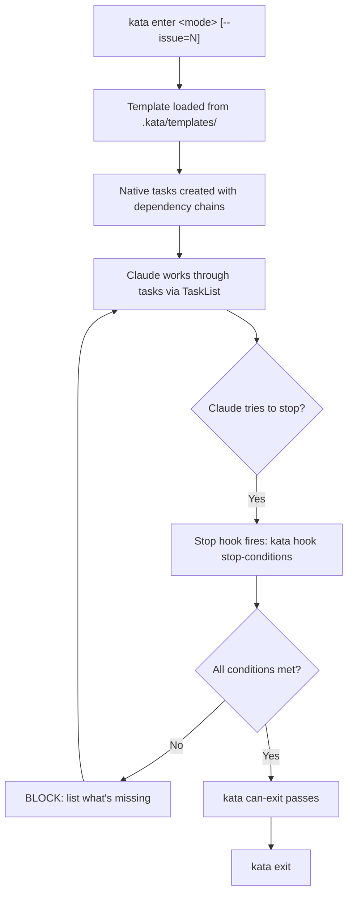
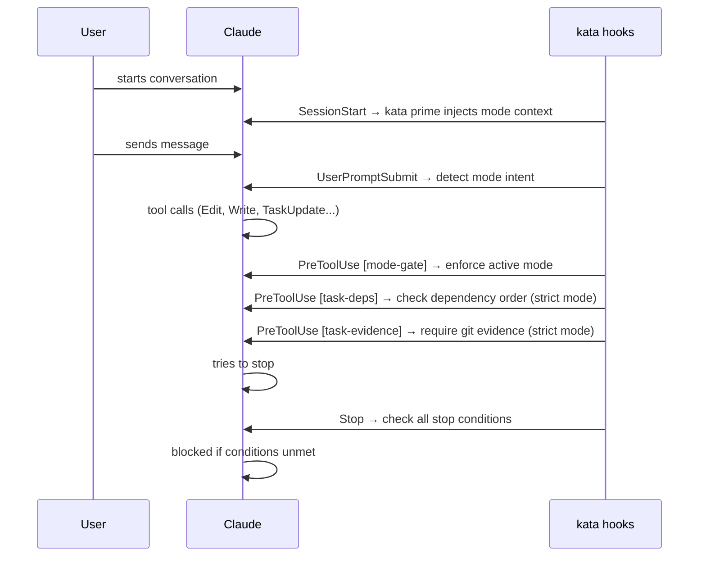

# @codevibesmatter/kata

Structured workflow CLI for [Claude Code](https://claude.ai/claude-code). Wraps sessions with modes, phase task enforcement, and a stop hook that blocks exit until phases are done.

## Table of Contents

1. [What kata does](#what-kata-does)
2. [Install](#install)
3. [Quick start](#quick-start)
4. [Built-in modes](#built-in-modes)
5. [How it works](#how-it-works)
   - [Mode lifecycle](#mode-lifecycle)
   - [Context injection](#context-injection)
   - [Planning → Implementation pipeline](#planning--implementation-pipeline)
   - [Hook chain](#hook-chain)
6. [Stop conditions](#stop-conditions)
7. [Command reference](#command-reference)
   - [Core commands](#core-commands)
   - [Other commands](#other-commands)
8. [Hooks reference](#hooks-reference)
9. [Configuration (kata.yaml)](#configuration-katayaml)
10. [Custom modes](#custom-modes)
11. [Batteries system](#batteries-system)
12. [Architecture](#architecture)
13. [Comparison to similar tools](#comparison-to-similar-tools)
14. [License](#license)

---

## What kata does

Claude sessions are unstructured by default. The agent can answer, stop, and close the session at any time — even mid-task, mid-phase, or before committing work.

**kata enforces that sessions complete.** When you enter a mode, kata creates native phase tasks with dependency chains. A stop hook intercepts every attempt to end the session and blocks exit until all phase tasks are done, work is committed, and any additional stop conditions are met.

Three concrete benefits:

- **Phase tasks auto-created** — `kata enter planning` creates the research → spec → review → approved task chain. Claude sees these via `TaskList` and follows them in order.
- **Stop hook blocks early exit** — Claude cannot end the session until all tasks are complete. No skipping the verify phase. No stopping before committing.
- **Session state survives context compaction** — mode, phase, and workflow ID are persisted to disk. Long sessions don't lose their place when the context window rolls over.

---

## Install

```bash
npm install --save-dev @codevibesmatter/kata
```

Or globally:

```bash
npm install -g @codevibesmatter/kata
```

---

## Quick start

**1. Install kata**

```bash
npm install --save-dev @codevibesmatter/kata
```

**2. Set up kata in your project**

Tell Claude:

> Set up kata for this project

Claude runs `kata setup`, registers the stop hook and session hooks in `.claude/settings.json`, and configures `.kata/kata.yaml` for your project. Alternatively, run `kata enter onboard` yourself — this starts the agent-guided onboarding walkthrough.

**3. Enter a mode**

For planning work linked to a GitHub issue:

```bash
kata enter planning --issue=42
```

For a small self-contained task (no issue required):

```bash
kata enter task
```

Phase tasks appear immediately in Claude's task list with dependency chains already set up.

**4. Work through the phases**

Claude follows the task dependency chain. Each phase must complete before the next unlocks. The stop hook silently blocks any attempt to end the session early.

**5. Check exit readiness and exit**

```bash
kata can-exit
# All stop conditions met — ready to exit

kata exit
```

If `kata can-exit` reports unmet conditions (pending tasks, uncommitted changes, tests failing), address them and check again.

---

## Built-in modes

| Mode | Name | Description | Issue required? | Stop conditions |
|------|------|-------------|-----------------|-----------------|
| `research` | Research | Explore and synthesize findings | No | tasks_complete, committed, pushed |
| `planning` | Planning | Research, spec, review, approved | **Yes** | tasks_complete, committed, pushed |
| `implementation` | Implementation | Execute approved specs | **Yes** | tasks_complete, committed, pushed, tests_pass, feature_tests_added |
| `task` | Task | Combined planning + implementation for small tasks | No | tasks_complete, committed |
| `freeform` | Freeform | Quick questions and discussion (no phases) | No | *(none — can always exit)* |
| `verify` | Verify | Execute Verification Plan steps | No | tasks_complete, committed, pushed |
| `debug` | Debug | Systematic hypothesis-driven debugging | No | tasks_complete, committed, pushed |
| `onboard` | Onboard | Configure kata for a new project | No | *(none — can always exit)* |

**Mode aliases:**

- `task` → also: `chore`, `small`
- `debug` → also: `investigate`
- `freeform` → also: `question`, `ask`, `help`, `qa`

`--issue=N` is required for `planning` and `implementation`. It is optional for all other modes.

---

## How it works

### Mode lifecycle



A **mode** is a named workflow — `planning`, `implementation`, `task`, etc. — defined by a template file. Each template has YAML frontmatter that specifies phases, task titles, and the dependency chains between them. When you run `kata enter <mode>`, kata reads that template, creates one native Claude task per phase step, and wires up the dependencies so Phase 2 is blocked until Phase 1 is marked complete.

**Native tasks** live in Claude's built-in task system at `~/.claude/tasks/{sessionId}/`. Claude discovers them via `TaskList` at the start of the session and advances through them with `TaskUpdate(taskId="X", status="completed")`. The dependency chains are real: Claude cannot mark a Phase 2 task complete while a Phase 1 task is still open. This is enforced either by Claude following the task metadata or, in strict mode, by the `task-deps` hook blocking the `TaskUpdate` call outright.

The **stop hook** is the enforcement mechanism. Every time Claude tries to end the session — whether it thinks the work is done, the user said thanks, or it just ran out of things to do — the `Stop` event fires and `kata hook stop-conditions` intercepts it. The hook checks every stop condition registered for the current mode. If any condition is unmet, the session is blocked and Claude receives a clear message listing exactly what's missing. Claude must satisfy the conditions before it can exit.

The **`--issue=N` flag** links a GitHub issue to the session for modes that require it (`planning`, `implementation`). This sets the `workflowId` to `GH#N`, enables the `feature_tests_added` check (which diffs against the issue branch to verify new test files were added), and populates the issue number into the session state. Checking issue linkage:

```
$ kata status
Mode: implementation
Phase: p1
Workflow ID: GH#42
Issue: #42
Entered: 2026-03-05T17:02:02Z
```

If stop conditions are not met, `kata can-exit` reports it:

```
✗ Cannot exit:
  2 task(s) still pending
    - [8] GH#42: P2.2 - Core Reference Sections
    - [9] GH#42: P2.2: TEST
  Uncommitted changes in tracked files
  Unpushed commits
```

---

### Context injection

Every time a new Claude conversation starts, the `SessionStart` hook fires and calls `kata prime`. This is how Claude knows what mode it's in, what tasks are pending, and what project rules to follow — without being told any of this in the user's first message.

`kata prime` outputs different content depending on session state:

- **No active mode**: Outputs a mode selection guide listing all available modes, their intent keywords, and the `kata enter <mode>` command to start one. This surfaces at the start of conversations where no mode has been entered yet.
- **Active mode**: Injects the full template instructions for the active mode, a session state ledger (mode, phase, workflow ID, pending tasks), and the project rules from `global_rules` and `task_rules` in `kata.yaml`.

This is why Claude immediately knows its mode and task list on session resumption — the context is re-injected from disk state, not inferred from chat history. When the context window compacts during a long session, the next user message triggers a new `SessionStart`, which re-injects the complete context. Sessions survive compaction without losing their place.

Example of what `kata prime` outputs for an active implementation session:

```
=== kata session context ===
Mode: implementation
Phase: p1
Workflow ID: GH#42
Issue: #42
Pending tasks: 3

=== Mode instructions ===
You are in implementation mode. Execute the approved spec...
[template content]

=== Rules ===
- Tasks are pre-created by kata enter. Do NOT create new tasks with TaskCreate.
- Run TaskList FIRST to discover pre-created tasks.
```

The `SessionStart` hook passes `--session=ID` explicitly when calling `kata prime` so the hook always reads from the correct session state file. Session ID is never inferred from environment variables at hook time.

---

### Planning → Implementation pipeline

```mermaid
flowchart LR
    A["kata enter planning --issue=42"] --> B[Research & spec phases]
    B --> C["Spec written to\nplanning/specs/42-slug.md"]
    C --> D[Spec reviewed & approved]
    D --> E["kata enter implementation --issue=42"]
    E --> F[Implementation reads spec\nphases from frontmatter]
    F --> G[Impl + test + review per phase]
    G --> H[Commit, push, PR, close issue]
```



**Planning mode** drives a structured sequence: research the problem, write the spec, review it, get it approved. The output is a spec file written to `planning/specs/{N}-{slug}.md` (configurable via `spec_path` in `kata.yaml`). The spec has YAML frontmatter that defines the implementation phases — this frontmatter is what the implementation mode reads.

**Implementation mode** picks up where planning left off. When you run `kata enter implementation --issue=42`, kata finds `planning/specs/42-*.md`, reads its YAML frontmatter, and creates the implementation phase tasks from it. The phases in the spec drive the task list — implementation is parameterized by the plan, not hardcoded. This means the implementation agent works from the exact spec that was reviewed and approved, not its own interpretation.

**The spec file is the explicit handoff artifact.** It is committed to the repo during the planning session so that the implementation agent can trust it as the approved plan. No verbal handoff, no re-deriving the approach from issue comments — the spec is the source of truth.

`spec_path` is configurable in `kata.yaml` (`spec_path: planning/specs`). If your project stores specs elsewhere, set this field and kata will find them.

For smaller work that doesn't need a separate planning phase, `kata enter task` handles both planning and implementation in one session. Task mode has lighter stop conditions (`tasks_complete`, `committed` — no `pushed`, no `tests_pass`, no `feature_tests_added`).

Implementation mode enforces stricter stop conditions than planning: it adds `tests_pass` (the project's test command must exit 0) and `feature_tests_added` (at least one new test file must appear in the diff vs `origin/main`). Planning only requires `tasks_complete`, `committed`, and `pushed`.

---

### Hook chain



See [Hooks reference](#hooks-reference) for details on each hook, registration tiers, and the full hook flow diagram.

---

## Stop conditions

Stop conditions are checked by `kata hook stop-conditions` every time Claude tries to end a session. Each mode declares which conditions apply in `modes.yaml`. `kata can-exit` runs the same check on demand — useful before calling `kata exit` or from CI scripts.

### Condition reference

| Condition | What it checks | Modes that use it |
|-----------|----------------|-------------------|
| `tasks_complete` | All native tasks in `~/.claude/tasks/{sessionId}/` have `status: completed` | research, planning, implementation, task, verify, debug |
| `committed` | No uncommitted changes in git working tree (`git status --porcelain` returns empty) | research, planning, implementation, task, verify, debug |
| `pushed` | Current HEAD has been pushed to a remote branch | research, planning, implementation, verify, debug |
| `tests_pass` | `project.test_command` from `kata.yaml` exits with code 0 | implementation only |
| `feature_tests_added` | At least one new test file added in the diff vs `project.diff_base` (default: `origin/main`) | implementation only |

`freeform` and `onboard` have no stop conditions — they can always exit.

### How to satisfy each condition

**`tasks_complete`** — Complete all phase tasks. In each phase, do the work and then call `TaskUpdate(taskId="X", status="completed")`. Run `TaskList` to see what's still pending.

**`committed`** — Stage and commit all changes: `git add <files> && git commit -m "..."`. `kata can-exit` re-checks `git status --porcelain`; it must return empty.

**`pushed`** — Push the current branch: `git push`. If the branch has no upstream yet: `git push -u origin <branch>`.

**`tests_pass`** — Fix any failing tests. The test command is set in `kata.yaml` under `project.test_command`. Run it directly to see what's failing.

**`feature_tests_added`** — Write at least one new test file in this implementation session. "New" means it appears in `git diff origin/main --name-only` and matches `project.test_file_pattern` (default: `**/*.test.ts`). Modifying existing test files does not satisfy this condition.

### Example output

Blocked:

```
✗ Cannot exit:
  2 task(s) still pending
    - [8] GH#42: P2.2 - Core Reference Sections
    - [9] GH#42: P2.2: TEST
  Uncommitted changes in tracked files
  Unpushed commits
```

Passing:

```
✓ All tasks complete. Can exit.
```

Use `kata can-exit --json` for machine-readable output in CI or scripts:

```json
{
  "canExit": false,
  "reasons": ["2 task(s) still pending", "Changes not committed"],
  "guidance": {
    "nextStepMessage": "...",
    "escapeHatch": "..."
  }
}
```

---

## Command reference

### Core commands

#### `kata enter`

Starts a mode session. Creates native phase tasks with dependency chains so Claude sees exactly what to do and in what order.

```
kata enter <mode> [--issue=N] [--template=PATH] [--dry-run]
```

| Flag | Description |
|------|-------------|
| `--issue=N` | Link to GitHub issue N. Required for `planning` and `implementation`. |
| `--template=PATH` | Use a custom template file for this session instead of the mode default. |
| `--dry-run` | Preview what tasks would be created without writing anything. |

Example — entering planning mode linked to issue #42:

```
$ kata enter planning --issue=42
Building phase tasks for workflow: GH#42
  Created step task: p0:read-spec
  Created step task: p0:verify-environment
  Created step task: p1:research-problem
  Created step task: p1:document-findings
  Created step task: p2:write-spec
  Created step task: p2:spec-review
  Created step task: p2:spec-approved
  Created step task: p3:implementation-plan
  Created step task: p3:review-plan
  Created step task: p4:commit-and-push
  Created step task: p4:verify-done
  Created step task: p4:close-issue
Native tasks written: ~/.claude/tasks/a1b2c3d4-e5f6-7890-abcd-ef1234567890/ (12 tasks)
```

---

#### `kata exit`

Exits the current mode and marks the session closed. Run this after `kata can-exit` reports all stop conditions met.

```
kata exit [--session=ID]
```

Session state is persisted to disk after exit and can be inspected afterward. Use `--session=ID` when calling from outside the active Claude session (e.g., from a script).

---

#### `kata status`

Shows the current session's mode, phase, workflow ID, and metadata.

```
kata status [--json] [--session=ID]
```

Text output:

```
Mode: implementation
Phase: p1
Workflow ID: GH#42
Issue: #42
Entered: 2026-03-05T17:02:02Z
```

JSON output (`--json`):

```json
{
  "sessionId": "964b1ba9-b78f-40fa-8e95-7cda6a6a530f",
  "sessionType": "implementation",
  "currentMode": "implementation",
  "currentPhase": "p1",
  "completedPhases": [],
  "workflowId": "GH#32",
  "issueNumber": 32,
  "template": "implementation.md",
  "phases": ["p1","p2","p3","p4"],
  "enteredAt": "2026-03-05T17:02:02.936Z"
}
```

---

#### `kata can-exit`

Checks whether all stop conditions for the current mode are met. Use this before `kata exit`.

```
kata can-exit [--json]
```

Blocked (text):

```
✗ Cannot exit:
  2 task(s) still pending
    - [8] GH#42: P2.2 - Core Reference Sections
    - [9] GH#42: P2.2: TEST
  Changes not committed
```

Passing (text):

```
✓ All tasks complete. Can exit.
```

JSON output (`--json`):

```json
{
  "canExit": false,
  "reasons": ["2 task(s) still pending", "Changes not committed"],
  "guidance": {
    "nextStepMessage": "**🎯 NEXT STEP (DO NOT SKIP):**\n1. DO THE ACTUAL WORK for this task\n2. When work is COMPLETE: TaskUpdate(taskId=\"X\", status=\"completed\")\n\n**Current task:** GH#42: P2.2 - Core Reference Sections",
    "escapeHatch": "**🚨 ONLY IF GENUINELY BLOCKED:**\nIf you have a legitimate question that prevents progress, use `AskUserQuestion` to get clarification. The conversation will pause until user responds.\n**DO NOT abuse this to skip conditions.**"
  }
}
```

---

#### `kata link`

Associates or removes a GitHub issue from the current session.

```
kata link [<issue>] [--show] [--clear]
```

| Invocation | Description |
|------------|-------------|
| `kata link 42` | Associate issue #42 with the current session |
| `kata link --show` | Print the currently linked issue number |
| `kata link --clear` | Remove the issue association from the session |

---

#### `kata doctor`

Diagnoses the kata installation and session state.

```
kata doctor [--fix] [--json]
```

Checks performed:

| Check | What it verifies |
|-------|-----------------|
| `sessions_dir` | Session state directory exists and is readable |
| `hooks_registered` | All expected hooks are present in `.claude/settings.json` |
| `native_tasks` | Native task directory structure is intact |
| `session_cleanup` | No orphaned or excessively stale session files |
| `version` | Installed kata version matches project expectations |

`--fix` auto-repairs common issues: re-registers missing hooks, creates missing directories, removes stale session files.

Run `kata doctor` when hooks stop firing, after manual edits to `.claude/settings.json`, or to diagnose unexpected session behavior.

---

#### `kata batteries`

Seeds the project with kata config files, mode templates, agent definitions, and spec stubs.

```
kata batteries [--update]
```

Files scaffolded:

| Source | Destination | Contents |
|--------|-------------|----------|
| `batteries/kata.yaml` | `.kata/kata.yaml` | Project config (project name, commands, spec paths, mode overrides) |
| `batteries/templates/*.md` | `.kata/templates/*.md` | Mode templates (research, planning, implementation, task, freeform, verify, debug) |
| `batteries/agents/` | `.claude/agents/` | Agent definitions (review-agent, impl-agent, etc.) |
| `batteries/spec-templates/` | `planning/spec-templates/` | Spec document stubs |
| `batteries/interviews.yaml` | `.kata/interviews.yaml` | Onboard interview questions |
| `batteries/subphase-patterns.yaml` | `.kata/subphase-patterns.yaml` | Phase pattern definitions |
| `batteries/verification-tools.md` | `.kata/verification-tools.md` | Verification tools reference |
| `batteries/github/ISSUE_TEMPLATE/` | `.github/ISSUE_TEMPLATE/` | GitHub issue templates |
| `batteries/github/labels.json` | `.github/wm-labels.json` | GitHub label definitions (used by onboard mode) |

`--update` overwrites existing project files with the latest versions from the installed package. Use this after `npm update @codevibesmatter/kata`. Commit your customizations first — `--update` overwrites them.

---

#### `kata setup`

Registers hooks and initializes the `.kata/` directory structure for a project.

```
kata setup [--strict] [--batteries] [--yes]
```

What it creates:

- Registers `SessionStart`, `UserPromptSubmit`, `Stop`, and `mode-gate` hooks in `.claude/settings.json`
- Creates the `.kata/` directory
- Writes `.kata/kata.yaml` with project defaults

| Flag | Description |
|------|-------------|
| `--strict` | Also registers `PreToolUse` hooks: `task-deps` and `task-evidence`. Enforces task dependency ordering and requires uncommitted git changes as evidence before completing tasks. |
| `--batteries` | Also runs the batteries scaffold after setup. Implies `--yes`. |
| `--yes` | Non-interactive — accept all defaults without prompting. |

For a guided walkthrough, run `kata enter onboard` instead. This starts an agent-guided session that interviews you about your project and configures kata interactively.

### Other commands

| Command | Flags | Description |
|---------|-------|-------------|
| `kata prime` | `[--session=ID] [--hook-json]` | Output context injection block used by the `SessionStart` hook to inject mode template, session state, and rules into Claude's context |
| `kata suggest <message>` | | Detect mode intent from a message and output guidance on which mode to enter |
| `kata hook <name>` | | Dispatch a named hook event; used internally by `.claude/settings.json` hook commands |
| `kata modes` | | List available modes from `kata.yaml` with names, aliases, and stop conditions |
| `kata init` | `[--session=ID] [--force]` | Initialize session state; `--force` resets existing state |
| `kata teardown` | `[--yes] [--all] [--dry-run]` | Remove kata hooks and config from the project |
| `kata config` | `[--show]` | Show resolved `kata.yaml` config with provenance (project vs. defaults) |
| `kata validate-spec` | `--issue=N \| path.md` | Validate a spec file's phase format and required sections |
| `kata validate-template` | `<path> [--json]` | Validate a template file's YAML frontmatter and structure |
| `kata init-mode` | `<name>` | Create a new mode — generates a template file and registers it in `kata.yaml` |
| `kata register-mode` | `<template-path>` | Register an existing template file as a mode in `kata.yaml` |
| `kata init-template` | `<path>` | Create a new blank template file with required frontmatter |
| `kata check-phase` | `<phase-id> [--issue=N] [--force]` | Run per-phase process gates for the specified phase |
| `kata review` | `--prompt=<name> [--provider=P]` | Run an ad-hoc agent review using a named review prompt |
| `kata prompt` | `[--session=ID]` | Output the current mode's rendered prompt |
| `kata postmortem` | | Run session postmortem analysis on the completed session |
| `kata projects` | `[list\|add\|remove\|init\|sync]` | Multi-project management subcommands |
| `kata providers` | `[list\|setup] [--json]` | Check or configure agent providers |

---

## Hooks reference

Hooks are shell commands registered in `.claude/settings.json` that Claude Code fires at specific lifecycle events. Each hook calls `kata hook <name>`, which reads the event JSON from stdin and writes a decision JSON to stdout.

### Hook event table

| Event | Command | When it fires | What it does |
|-------|---------|---------------|--------------|
| `SessionStart` | `kata hook session-start` | Every new Claude conversation | Initializes session registry; injects mode template, session state, and rules into Claude's context via `kata prime` |
| `UserPromptSubmit` | `kata hook user-prompt` | Every user message | Detects mode intent from message text; suggests `kata enter <mode>` if no mode is active |
| `PreToolUse` (mode-gate) | `kata hook mode-gate` | Every tool call | Blocks file writes when no kata mode is active; also injects `--session=ID` into kata bash commands |
| `PreToolUse` (task-deps) | `kata hook task-deps` | `TaskUpdate` calls | Enforces task dependency ordering — blocks completing a task if its dependencies are not yet done (strict mode only) |
| `PreToolUse` (task-evidence) | `kata hook task-evidence` | `TaskUpdate` "completed" calls | Requires uncommitted git changes as evidence before a task can be marked complete (strict mode only) |
| `Stop` | `kata hook stop-conditions` | When Claude tries to end the session | Checks all stop conditions for the current mode; blocks exit and lists unmet conditions if any remain |

### Registration tiers

**Always registered** (by `kata setup`): `session-start`, `user-prompt`, `stop-conditions`, `mode-gate`

**Strict mode only** (`kata setup --strict`): `task-deps`, `task-evidence`

Note: `mode-gate` is always registered — not just in strict mode — because it also resolves `--session=ID` for all `kata` bash commands. This session ID forwarding is required for any hook-invoked subcommand to find the correct session state.

### Hook flow

```
User message
    │
    ▼
UserPromptSubmit ──► kata hook user-prompt
    │                  Detect mode intent → suggest kata enter
    │
    ▼
Claude tool call
    │
    ▼
PreToolUse ──────► kata hook mode-gate
    │                  Block writes if no mode active
    │                  Inject --session=ID into kata commands
    │
    ├──────────────► kata hook task-deps      (strict mode only)
    │                  Enforce dependency ordering
    │
    └──────────────► kata hook task-evidence  (strict mode only)
                       Require git evidence before completing task
    │
    ▼
Claude Stop event
    │
    ▼
Stop ─────────────► kata hook stop-conditions
                       Check tasks_complete, committed, pushed, etc.
                       Block exit if any condition unmet
```

---

## Configuration (kata.yaml)

`kata.yaml` is the single configuration file for a kata-managed project, living at `.kata/kata.yaml`. It controls project commands, path conventions, stop condition behavior, reviews, and project-level mode overrides.

### Annotated example

```yaml
project:
  name: my-project           # Display name shown in kata status
  build_command: npm run build      # Run before typecheck in TEST phase
  test_command: npm test            # Used by tests_pass stop condition
  typecheck_command: npm run typecheck  # Run in TEST phase
  smoke_command: null               # Optional quick smoke test
  diff_base: origin/main            # Branch to diff against for feature_tests_added
  test_file_pattern: "**/*.test.ts" # Glob to identify test files
  ci: null                          # CI system (optional)
  dev_server_command: null          # Dev server command (optional)
  dev_server_health: null           # Health check URL (optional)

spec_path: planning/specs           # Where spec files live (spec N-slug.md)
research_path: planning/research    # Where research outputs are saved
session_retention_days: 7           # How long to keep completed session state

non_code_paths:                     # Paths excluded from code-change checks
  - .claude
  - .kata
  - planning

reviews:
  spec_review: false                # Enable spec review agent in planning mode
  code_review: false                # Enable code review agent in implementation mode
  spec_reviewer: null               # Reviewer provider name
  code_reviewer: null               # Reviewer provider name

providers:
  default: claude                   # Default agent provider
  available: [claude]               # Available providers

global_rules: []                    # Rules injected into all mode templates via prime
task_rules:                         # Rules injected when mode has phases
  - "Tasks are pre-created by kata enter. Do NOT create new tasks with TaskCreate."
  - "Run TaskList FIRST to discover pre-created tasks and their dependency chains."

modes:                              # Project-level mode overrides (merged with built-ins)
  my-custom-mode:
    template: my-mode.md
    stop_conditions: [tasks_complete, committed]
    issue_handling: none            # "required" | "none"
    issue_label: feature
    name: "My Custom Mode"
    description: "..."
    workflow_prefix: "MC"           # 2-letter prefix for workflow IDs
    intent_keywords:
      - "my custom task"
    aliases:
      - "custom"
```

### Field reference

| Field | Type | Default | Description |
|-------|------|---------|-------------|
| `project.name` | string | `""` | Display name for the project |
| `project.build_command` | string | null | Build command run before typecheck in the TEST phase |
| `project.test_command` | string | null | Test command used by the `tests_pass` stop condition |
| `project.typecheck_command` | string | null | Typecheck command run in the TEST phase |
| `project.smoke_command` | string | null | Optional quick smoke test command |
| `project.diff_base` | string | `origin/main` | Branch to diff against for the `feature_tests_added` stop condition |
| `project.test_file_pattern` | string | `**/*.test.ts` | Glob pattern used to identify test files |
| `spec_path` | string | `planning/specs` | Directory where spec files are written (`spec N-slug.md`) |
| `research_path` | string | `planning/research` | Directory where research outputs are saved |
| `session_retention_days` | number | `7` | Days to retain completed session state files before cleanup |
| `non_code_paths` | string[] | `[.claude, .kata, planning]` | Paths excluded from code-change checks (e.g., `feature_tests_added`) |
| `reviews.spec_review` | boolean | `false` | Enable the spec review agent in planning mode |
| `reviews.code_review` | boolean | `false` | Enable the code review agent in implementation mode |
| `reviews.spec_reviewer` | string | null | Provider name for spec review |
| `reviews.code_reviewer` | string | null | Provider name for code review |
| `global_rules` | string[] | `[]` | Rules injected into every mode's context via `kata prime` |
| `task_rules` | string[] | see above | Rules injected when the active mode has phases (task tracking) |
| `modes` | object | `{}` | Project-level mode definitions merged over the built-in mode set; project definitions take precedence |

---

## Custom modes

kata ships with a built-in set of modes (planning, implementation, task, bugfix, etc.), but you can define your own to match your team's workflow.

### Creating a custom mode

**Option 1 — CLI scaffold:**

```
kata init-mode <name>
```

Creates a template file in `.kata/templates/<name>.md` with frontmatter stubs and registers the mode in `.kata/kata.yaml`.

**Option 2 — Manual:**

1. Write a template file (see schema below).
2. Register it:

```
kata register-mode <path-to-template>
```

---

### Template frontmatter schema

Every mode template starts with YAML frontmatter that defines the mode's phases, tasks, and dependency chain:

```markdown
---
id: <string>                # Mode identifier (matches kata.yaml key)
name: <string>              # Human-readable mode name
description: <string>       # Brief description
mode: <string>              # Alias for id (used for display)
phases:
  - id: <string>            # Phase ID (e.g. p0, p1)
    name: <string>          # Phase name (e.g. "Research")
    task_config:
      title: <string>       # Title for native TaskCreate task
      labels: [string]      # Optional task labels
    steps:                  # Ordered sub-steps Claude follows within this phase
      - id: <string>        # Step identifier
        title: <string>     # Step title
        instruction: |      # Freeform markdown instructions for Claude
          ...
    depends_on: [<phase-id>]  # Phases that must complete before this one
---
```

**Key field notes:**

- `steps` defines the sub-tasks inside each phase. Each step becomes one native task visible in Claude's task list.
- `task_config.title` is the label shown for the phase's native TaskCreate entry.
- `depends_on` creates the blocking relationship between phases. Phase `p1` will not become available until every phase listed in its `depends_on` array is complete.
- The body of the template file (the markdown below the frontmatter) is the mode instruction text injected into Claude's context by `kata prime`.

**Real examples in the package:**

- `batteries/templates/planning.md` — a multi-phase mode with complex step trees and spec-writing instructions
- `batteries/templates/implementation.md` — shows the subphase pattern and code-review integration

---

### Registering the mode in kata.yaml

After creation, the mode appears in the `modes:` section of `.kata/kata.yaml`. All standard mode fields apply:

```yaml
modes:
  my-mode:
    template: my-mode.md         # Relative to .kata/templates/
    stop_conditions: [tasks_complete, committed]
    issue_handling: none         # "required" | "none"
    name: "My Mode"
    description: "What it does"
    workflow_prefix: "MM"        # 2-letter prefix for workflow IDs
    intent_keywords:
      - "do my thing"
    aliases:
      - "mm"
```

| Field | Required | Description |
|-------|----------|-------------|
| `template` | yes | Template filename relative to `.kata/templates/` |
| `stop_conditions` | yes | Exit checks that must pass before `kata exit` is allowed |
| `issue_handling` | yes | `"required"` (mode entry needs a GitHub issue) or `"none"` |
| `name` | yes | Display name shown in `kata prime` and task headers |
| `description` | no | One-line description shown in mode listings |
| `workflow_prefix` | no | Two-letter prefix for workflow IDs (e.g. `MM-abc123`) |
| `intent_keywords` | no | Phrases that trigger mode-suggestion in `UserPromptSubmit` hook |
| `aliases` | no | Short aliases accepted by `kata enter` |

---

## Batteries system

`kata batteries` seeds a project with starter content from the kata package: mode templates, agent definitions, spec stubs, and config files. It is idempotent — safe to re-run at any time. Without `--update`, it never overwrites files that already exist.

### Two use cases

**1. Initial scaffold**

Run once at project setup, or automatically as part of `kata setup --batteries`. Creates the starter templates and config files your project needs to start using kata modes.

**2. Upgrading templates**

After running `npm update @codevibesmatter/kata`, run:

```
kata batteries --update
```

This overwrites project files with the latest versions from the updated package. **Commit your customizations first** — `--update` overwrites without merging. Any local edits to template files will be lost.

### Files are yours to own

Files seeded by `kata batteries` are the project's to own and customize. kata does not reference package templates at runtime — it reads from `.kata/templates/` (or `.claude/workflows/templates/` for old-layout projects). Editing, extending, or replacing the seeded templates is encouraged and expected.

See [`kata batteries`](#kata-batteries) for the full list of scaffolded files.

---

## Architecture

### Source layout

| Directory / File | Purpose |
|-----------------|---------|
| `src/index.ts` | CLI dispatcher — maps `kata <command>` to handler functions; also re-exports the programmatic API |
| `src/commands/` | One file per CLI command (`enter.ts`, `exit.ts`, `hook.ts`, `setup.ts`, etc.) |
| `src/commands/enter/` | Sub-modules for the enter command: `task-factory.ts`, `guidance.ts`, `template.ts`, `spec.ts` |
| `src/session/lookup.ts` | Project root discovery, session ID resolution, template path resolution |
| `src/state/` | Zod schema (`schema.ts`), reader/writer for `SessionState` JSON |
| `src/config/` | `kata-config.ts` loads and validates `.kata/kata.yaml`; config helpers for interviews, setup profiles, and subphase patterns |
| `src/validation/` | Phase/template validation |
| `src/yaml/` | YAML frontmatter parser for template files |
| `src/utils/` | Workflow ID generation, session cleanup, timestamps |
| `src/testing/` | Test utilities exported as `@codevibesmatter/kata/testing` |

### Runtime data layout

| Path | Contents |
|------|---------|
| `.kata/sessions/{sessionId}/state.json` | Per-session `SessionState` — mode, phase, workflow ID, issue number |
| `.kata/kata.yaml` | Project config (`WmConfig`) — commands, spec paths, mode overrides |
| `.kata/templates/` | Project-owned mode templates (seeded by batteries, customizable) |
| `.kata/verification-evidence/` | Output from verify mode runs |
| `~/.claude/tasks/{sessionId}/` | Native task files (Claude-owned, created by `kata enter`) |
| `.claude/settings.json` | Hook registration (Claude-owned) |
| `.claude/agents/` | Agent definitions (review-agent, impl-agent, etc.) |

### Hook registration

Hooks are registered in `.claude/settings.json` using the `kata hook <name>` dispatch pattern. Each hook reads Claude Code's stdin JSON, extracts `session_id`, and outputs a JSON decision. The session ID from hook stdin must be forwarded as `--session=ID` to any subcommand — there is no automatic session detection at hook time.

### Backwards compatibility

Projects using `.claude/workflows/` instead of `.kata/` are supported. `getKataDir()` checks for `.kata/` first and falls back to `.claude/workflows/`. All path helpers (`getSessionsDir()`, `getProjectTemplatesDir()`, etc.) handle both layouts transparently, so existing projects do not need to migrate.

### Eval harness

An agentic eval harness in `eval/` drives Claude agents through kata scenarios with real tool execution, used for regression testing kata's workflow enforcement. See `eval/README.md` for details.

---

## Comparison to similar tools

The Claude Code ecosystem has several workflow and memory tools. Here's how `kata` fits in.

### Beads (`@beads/bd`)
**[github.com/steveyegge/beads](https://github.com/steveyegge/beads)**

The most influential tool in this space. A git-backed task tracker with a dependency graph — JSONL files in `.beads/`, hash-based IDs to prevent merge conflicts, `bd ready` to surface only unblocked work. Solves "agent amnesia": agents lose all context of prior work between sessions. Anthropic's native `TaskCreate`/`TaskUpdate` system was directly inspired by beads.

**vs `kata`:** Complementary, not competitive. Beads is project-level memory across sessions (days/weeks); `kata` is session-level enforcement within a single session. They stack well — beads tracks what needs doing across the project, `kata` enforces how a single session executes.

---

### RIPER Workflow
**[github.com/tony/claude-code-riper-5](https://github.com/tony/claude-code-riper-5)**

Five-phase structured development: Research → Innovate → Plan → Execute → Review. Enforces phases through **capability restrictions** — in Research mode Claude has read-only access so it can't prematurely write code.

**vs `kata`:** Closest conceptual match. Both enforce named phases in sequence. Key difference: RIPER gates at the *capability* level (what Claude can do in each phase); `kata` gates at the *exit* level (Claude can do anything, but can't stop until phases are done).

---

### Claude Task Master
**[github.com/eyaltoledano/claude-task-master](https://github.com/eyaltoledano/claude-task-master)**

Parses PRDs into structured tasks using AI via MCP. Handles full task lifecycle with subtask expansion and status tracking.

**vs `kata`:** Task Master is about *creating* a backlog from requirements; `kata` is about *enforcing* that the current session's tasks complete. Different problem.

---

### Summary

| Tool | Core problem | Enforcement | Scope |
|------|-------------|-------------|-------|
| [beads](https://github.com/steveyegge/beads) | Agent amnesia / task tracking | None — agent decides | Project (weeks) |
| [RIPER](https://github.com/tony/claude-code-riper-5) | Phase discipline | Capability gating per phase | Session |
| [Task Master](https://github.com/eyaltoledano/claude-task-master) | PRD → structured backlog | None | Project |
| **kata** | **Session phase enforcement** | **Stop hook blocks exit** | **Session** |

`kata`'s unique position: the only tool focused on *enforcing that sessions complete correctly* via the Stop hook, rather than helping plan or remember work.

---

## License

MIT
